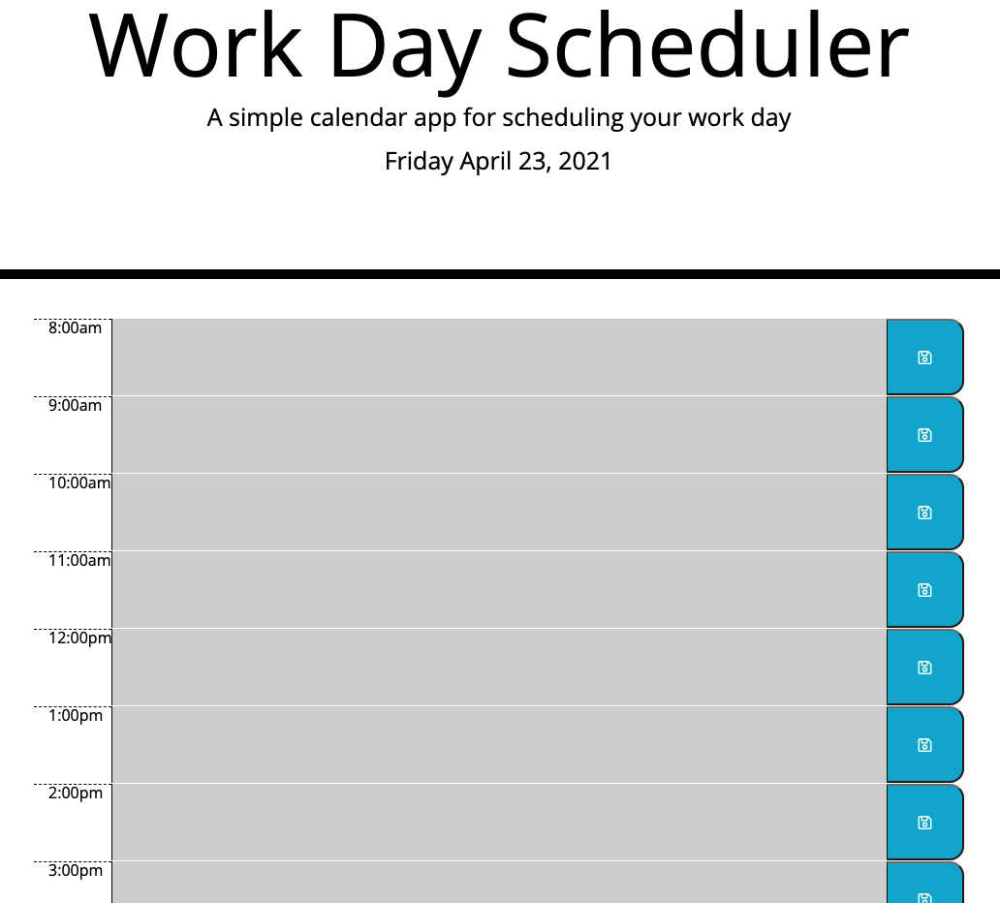

# Day-Planner

## Table of Contents
- [Description](#description)
- [Installation](#installation)
- [Usage](#usage)
- [Technology](#technology)
- [Contact](#contact)

# Description

This Day Planner application is a simple, yet efficient, tool to help organize your work day.  

# Installation
No installation required. Please see link to the deployed application:

* Deployed Application - https://mandellbutler.github.io/Day-Planner/

# Usage

* When the planner is opened, the current day is prominently displayed at the top of the page.
* With the use of color coding, the user can easily distinguish past, present and future events.
* The screen is reactive, adapting to both mobile and larger screen layouts.
* With a swift click of a button, the user can be assured that their events will be saved, safe and secure thanks the planner's use of local storage. Simply refresh the page, and the information remains!

# Technology
The design of this application was made possible with the following Development Tools:

* Moment.js 
* JQuery 
* Vanilla Javascript
* Bootstrap

# Contact

Please feel free to contact me, should you have any questions!

- <a href="https://github.com/mandellbutler">

- <a href="https://www.linkedin.com/in/mandellbutler/">

- [Email]: mandell.butler@outlook.com
